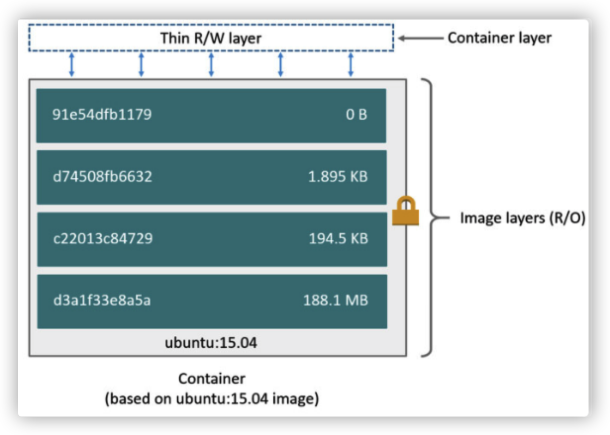
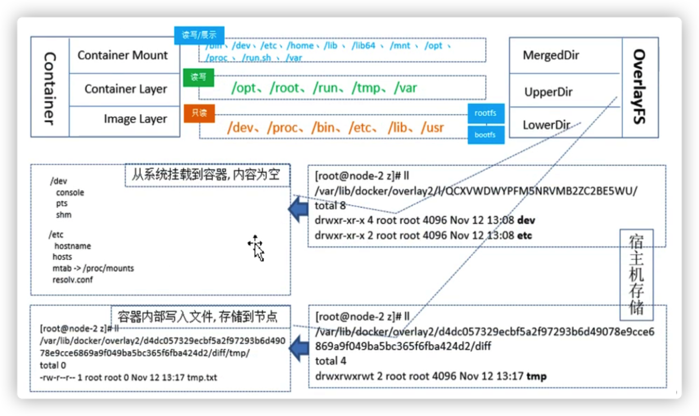

## Docker存储引擎

> 参考：[https://www.cnblogs.com/Gmiaomiao/p/13174618.html](https://www.cnblogs.com/Gmiaomiao/p/13174618.html)
> 官网文档：[https://docs.docker.com/storage/storagedriver/select-storage-driver/](https://docs.docker.com/storage/storagedriver/select-storage-driver/)
> overlay ：[https://www.cnblogs.com/lhanghang/p/13556629.html](https://www.cnblogs.com/lhanghang/p/13556629.html)

目前docker的默认存储引擎为overlay2，不同的存储引擎需要相应的文件系统支持，如需要磁盘分区的时候传递d-type稳健分层功能，即需要传递内核参数并开启格式化磁盘的时候指定的功能

### 设计思想

Docker 存储引擎的核心思想是“层”的概念，理解了这个层，就基本可以理解它的设计思路。当我们拉取一个 Docker 镜像的时候，可以看到如下:
```
# docker pull nginx
Using default tag: latest
latest: Pulling from library/nginx
a2abf6c4d29d: Downloading [========================>                          ]  15.25MB/31.36MB
f3409a9a9e73: Downloading [==================>                                ]  9.161MB/25.35MB
9919a6cbae9c: Download complete 
fc1ce43285d7: Download complete 
1f01ab499216: Download complete 
13cfaf79ff6d: Download complete
```
一个镜像被分成许多的“层”，每“层”包含了若干的文件，而一层层堆叠起来就组成了我们的一个完整的镜像。我们镜像中的文件就是所有“层”文件的并集。    我们构建 Docker 镜像一般采用 Dockerfile 的方式，而 Dockerfile 的每行命令，其实就会生成一个“层”，即使什么文件都没有添加。
```
FROM ubuntu:15.04
COPY . /app
RUN make /app
CMD python /app/app.py
```

Docker 的镜像（image）是静态的，所以当镜像构建完成后，所有的层都是只读的，并会赋予一个唯一的 ID。而容器（container)是动态的，当容器启动后，Docker 会给这个容器创建一个可读写“层”，位于所有镜像“层”的最上面。我们对容器的所有操作也就是在这个“层”里完成，当我们执行 `docker commit` 将容器生成镜像的时候，就是把这个“层”给拍了个快照，添加了一个新的只读层。

**文件的创建是在读写层增加文件，那修改和删除呢？**

这就要提一下 Docker 设计的 copy-on-write (CoW) 策略。

当我们试图读取一个文件时，Docker 会从上到下一层层去找这个文件，找到的第一个就是我们的文件。所以下面层相同的文件就被“覆盖”了。而修改就是当我们找到这个文件时，将它“复制”到读写层并修改，这样读写层的文件就是我们修改后的文件，并且“覆盖”了镜像中的文件了。而删除就是创建了一个特殊的 `whiteout` 文件，这个 `whiteout` 文件覆盖的文件即表示删除了。

**这样的设计有什么好处吗？**

第一个好处是减少了存储空间，由于镜像被分成了多个层，而各个层是静态只读的，是可以共享的。当你从一个镜像构建另一个镜像时，只需要添加新的层，原有的层不会被复制。

我们可以用 `docker history` 命令查看我们创建的镜像，相同的层将共享且只保存一份。
```
root@ubuntu-xenial:~# docker history  nginx
IMAGE          CREATED      CREATED BY                                      SIZE      COMMENT
f6987c8d6ed5   6 days ago   /bin/sh -c #(nop)  CMD ["nginx" "-g" "daemon…   0B        
<missing>      6 days ago   /bin/sh -c #(nop)  STOPSIGNAL SIGQUIT           0B        
<missing>      6 days ago   /bin/sh -c #(nop)  EXPOSE 80                    0B        
<missing>      6 days ago   /bin/sh -c #(nop)  ENTRYPOINT ["/docker-entr…   0B        
<missing>      6 days ago   /bin/sh -c #(nop) COPY file:09a214a3e07c919a…   4.61kB    
<missing>      6 days ago   /bin/sh -c #(nop) COPY file:0fd5fca330dcd6a7…   1.04kB    
<missing>      6 days ago   /bin/sh -c #(nop) COPY file:0b866ff3fc1ef5b0…   1.96kB    
<missing>      6 days ago   /bin/sh -c #(nop) COPY file:65504f71f5855ca0…   1.2kB     
<missing>      6 days ago   /bin/sh -c set -x     && addgroup --system -…   61.1MB    
<missing>      6 days ago   /bin/sh -c #(nop)  ENV PKG_RELEASE=1~bullseye   0B        
<missing>      6 days ago   /bin/sh -c #(nop)  ENV NJS_VERSION=0.7.0        0B        
<missing>      6 days ago   /bin/sh -c #(nop)  ENV NGINX_VERSION=1.21.4     0B        
<missing>      6 days ago   /bin/sh -c #(nop)  LABEL maintainer=NGINX Do…   0B        
<missing>      7 days ago   /bin/sh -c #(nop)  CMD ["bash"]                 0B        
<missing>      7 days ago   /bin/sh -c #(nop) ADD file:09675d11695f65c55…   80.4MB    
root@ubuntu-xenial:~# docker history  nginx:new
IMAGE          CREATED          CREATED BY                                      SIZE      COMMENT
cb6c54821a51   15 seconds ago   nginx -g daemon off;                            1.11kB    
f6987c8d6ed5   6 days ago       /bin/sh -c #(nop)  CMD ["nginx" "-g" "daemon…   0B        
<missing>      6 days ago       /bin/sh -c #(nop)  STOPSIGNAL SIGQUIT           0B        
<missing>      6 days ago       /bin/sh -c #(nop)  EXPOSE 80                    0B        
<missing>      6 days ago       /bin/sh -c #(nop)  ENTRYPOINT ["/docker-entr…   0B        
<missing>      6 days ago       /bin/sh -c #(nop) COPY file:09a214a3e07c919a…   4.61kB    
<missing>      6 days ago       /bin/sh -c #(nop) COPY file:0fd5fca330dcd6a7…   1.04kB    
<missing>      6 days ago       /bin/sh -c #(nop) COPY file:0b866ff3fc1ef5b0…   1.96kB    
<missing>      6 days ago       /bin/sh -c #(nop) COPY file:65504f71f5855ca0…   1.2kB     
<missing>      6 days ago       /bin/sh -c set -x     && addgroup --system -…   61.1MB    
<missing>      6 days ago       /bin/sh -c #(nop)  ENV PKG_RELEASE=1~bullseye   0B        
<missing>      6 days ago       /bin/sh -c #(nop)  ENV NJS_VERSION=0.7.0        0B        
<missing>      6 days ago       /bin/sh -c #(nop)  ENV NGINX_VERSION=1.21.4     0B        
<missing>      6 days ago       /bin/sh -c #(nop)  LABEL maintainer=NGINX Do…   0B        
<missing>      7 days ago       /bin/sh -c #(nop)  CMD ["bash"]                 0B        
<missing>      7 days ago       /bin/sh -c #(nop) ADD file:09675d11695f65c55…   80.4MB    
```

我们可以在系统的 `/var/lib/docker/<存储驱动>/` 下看到我们所有的层。  
第二个好处是启动容器就变得非常轻量和快速。因为我们的容器只是添加了一个“空”的读写层，其他的都是复用的只读层，需要用时才会去搜索。

### 存储驱动类型

Docker 的存储引擎针对不同的文件系统，是由不同的存储驱动。

Docker 主要有一下几类存储驱动：
*   **overlay2**：是当前版本推荐的存储驱动，无需额外的依赖和配置即可发挥绝佳的性能。在 18.09 版本之后替换了 overlay 存储驱动。支持 xfs(在ftype = 1的情况下)，ext4 文件系统。
*   aufs：Docker 早期使用的存储驱动，是 Docker 18.06 版本之前，Ubuntu 14.04 版本前推荐的。支持 xfs，ext4 文件系统。
*   devicemapper：是较早版本的 CentOS 和 RHEL 系统推荐的存储驱动，因为它们不支持 overlay2，需要 direct-lvm 的支持。
*   btrfs：仅用于 btrfs 文件系统。
*   zfs：仅用于 zfs 文件系统。
*   vfs：不依赖于文件系统，但是性能奇差，主要用来测试。

> 需要注意的是: 
> 1) overlay2、overlay、aufs 的层是基于**文件**的，当单文件的写并发较高时需要大内存的支持，且读写层可能因为单个文件而变得很大。
> 2) devicemapper、btrfs、zfs 的层是基于**块存储**的，因此对于单个文件的高并发影响不大。但是 btrfs 和 zfs 非常消耗内存。

有条件的情况下，我们还是建议选择 overlay2 的存储驱动。

### OverlayFS
#### Linux 系统运行基础
Linux 系统正常运行, 通常需要两个文件系统:
* `boot file system (bootfs)`
   1) 包含 Boot Loader与Kernel文件,用户不能修改这些文件。并且在系统启动过程完成之后, 整个系统的内核都会被加载进内存。此时bootfs会被卸载, 从而释放出所占用的系统内存。
  2) 在容器中可以运行不同版本的Linux, 说明对于同样内核版本的不同的 Linux 发行版的 bootfs 都是一致的, 否则会无法启动。因此可以推断, Docker运行是需要内核支持的。
  3) Linux系统中典型的bootfs目录: (核心) /boot/vmlinuz、(核心解压缩所需 RAM Disk) /boot/initramfs
* `root file system (rootfs)`
   1) 不同的Linux发行版本, bootfs相同, rootfs不同(二进制文件)。
   2) 每个容器有自己的 rootfs, 它来自不同的 Linux 发行版的基础镜像,包括 Ubuntu， Debian 和 SUSE 等。
   3) 使用不同的rootfs 就决定了, 在构建镜像的过程中, 可以使用哪些系统的命令。 
  4) 典型的rootfs 目录: /dev、/proc、/bin、/etc、 /lib、/usr

####  OverlayFS 存储原理
  OverlayFS 是从 aufs 之上改进和简化而来的，比 aufs 和 devicemapper 有更好的性能，大部分情况下也比 btrfs 好。
    OverlayFS 结构分为三个层: `LowerDir`、`Upperdir`、`MergedDir`
* `LowerDir (只读)`
　　只读的 image layer，其实就是 rootfs, 在使用 Dockerfile 构建镜像的时候, Image Layer
　　　　可以分很多层,所以对应的 lowerdir 会很多(源镜像)。
* `Upperdir (读写)`
　　upperdir 则是在 lowerdir 之上的一层, 为读写层。容器在启动的时候会创建, 所有对容器的修改, 都是在这层。比如容器启动写入的日志文件，或者是应用程序写入的临时 文件。
* `MergedDir (展示)`
　　MergedDir 目录是容器的挂载点,在用户视角能够看到的所有文件，都是从这层展示的。

LowerDir、Upperdir、MergedDir 关系图:


**特性：**
* **页缓存**：overlayFS 支持页缓存分享，多个容器如果读取相同层的同一个文件，可以共享页缓存，有效利用内存，使得它对于高并发读场景十分高效。
* **层查找**：由于第一次修改只读层文件时需要复制到读写层，所以对于大文件会有一些延迟。但是 overlayFS 还是比 aufs 更快，因为在搜索和缓存方面做了不少优化。
* **重命名**：overlayFS 不支持不同层文件的重命名操作，需要修改为复制然后删除。
#### 镜像的存储结构
**获取镜像存储路径**
```
$ docker inspect  image_name/image_id
....
        "GraphDriver": {
            "Data": {
                "LowerDir": "/var/lib/docker/overlay2/0327c5b0651d542787c486344309f1d987c0d1eec7d295e3ddf7361cbf45d14a/diff:/var/lib/docker/overlay2/5cbce5e3378dcbefc0e07dcc1cbe3f613672b968ef4d597450d1339fed0a9d21/diff:/var/lib/docker/overlay2/806e3cb7df6da370e9a019a885c22910307a4ebc3134883c2e36192715add56a/diff:/var/lib/docker/overlay2/84909920ee1463c7a9705f45831b3e907a11a5ffa3c96a17c58393e63114fe6e/diff:/var/lib/docker/overlay2/9c2079932dd0a050d3454eebc76c4346d231e84d0e7a8201c526924cbe41e1ab/diff:/var/lib/docker/overlay2/d3b8fe7c368851b63c1124da1cf4c0d97c634ef92248dbf5262b38f761fe38d5/diff:/var/lib/docker/overlay2/403a4842e9b8a2c852db3b31c18a9ef7376e10745234cc888b45c8465b31d174/diff:/var/lib/docker/overlay2/a688eafd2e410fe43225cef2d996f6253fa703f77ad52f313441b1ca137d2cb4/diff:/var/lib/docker/overlay2/084c86479601559bb4343476d18b5f3f9f3da731e8ba707a7f9276cb58a14fe8/diff:/var/lib/docker/overlay2/ca83b1c8447afdad29673acab13991cd83cd4899dd9370c58d45fc7ee8d34219/diff:/var/lib/docker/overlay2/1d638b9f12f3cf0c3b053397125d5ed1ae72a547d578554bee308ee190b691b3/diff:/var/lib/docker/overlay2/b30c6ef11cfda30e33f32e3a424540b4524da983a56cc2e2eabad377ea68d79e/diff:/var/lib/docker/overlay2/ac90cb8b9581f49992cd89e9df290679446b12d7bce36a8eb7f102c884d9cbcd/diff:/var/lib/docker/overlay2/c2ba4deaf300a91e9397d0182f39d69c2aea12c51476dd1da7ad81f809e576d0/diff:/var/lib/docker/overlay2/eaef62ff1f48ec98c92f9e4899ccacbf493a4645f2b6aa8777cc0571fcc37e72/diff:/var/lib/docker/overlay2/8441b589ff918a8f7b2db46ad3f2f2a6127513e161def9210f0e61795057c807/diff:/var/lib/docker/overlay2/3be68f22f189552deb55dfdcaa8231d304a6f8816eb196cb4821f23c7dad6dc9/diff:/var/lib/docker/overlay2/1ea1c6405f0375db13fd030486bbef0bffbe66622eb9ea221c7a7cfda84f6046/diff:/var/lib/docker/overlay2/2252a056d693614157e76b6ac07ba8abdf3feeaaa15df6468f85cebb98bd49e9/diff:/var/lib/docker/overlay2/53adfc7fdc3df9e0728346b657a8c2bc3279d277a7dc70fc9e7d951b4adba271/diff",
                "MergedDir": "/var/lib/docker/overlay2/437f0702dae3b6fc6e6bd220578c9b4e415c3c53a621b9150ddd170c9f08fe11/merged",
                "UpperDir": "/var/lib/docker/overlay2/437f0702dae3b6fc6e6bd220578c9b4e415c3c53a621b9150ddd170c9f08fe11/diff",
                "WorkDir": "/var/lib/docker/overlay2/437f0702dae3b6fc6e6bd220578c9b4e415c3c53a621b9150ddd170c9f08fe11/work"
            },
            "Name": "overlay2"
        },
....
```
**Lower层**
　　LowerDir 层的存储是不允许创建文件, 此时的LowerDir实际上是其他的镜像的UpperDir层，也就是说在构建镜像的时候, 如果发现构建的内容相同, 那么不会重复的构建目录，而是使用其他镜像的Upper 层来作为本镜像的Lower
**Merged层**
　　属于对外展示层，只能在运行中的容器查看，镜像是查看不了的
#### 运行中容器的存储结构
1) 启动一个容器
```
 docker run -d -it image_name sleep 1000
```
2) 查看容器的存储目录信息
容器启动以后，挂载merged、lowerdir、upperdir以及workdir目录
lowerdir是只读的image layer，其实就是rootfs
```
$ docker ps
CONTAINER ID   IMAGE          COMMAND        CREATED          STATUS          PORTS     NAMES
f25670308855   e2c4afea8894   "sleep 1000"   58 seconds ago   Up 57 seconds             quirky_cray
$ docker inspect quirky_cray <--容器名称
        "GraphDriver": {
            "Data": {
                "LowerDir": "/var/lib/docker/overlay2/5c87fd383ad3cef80e09301ccb535ee1b67f6f696b378107a09d9d0c33ddec6a-init/diff:/var/lib/docker/overlay2/437f0702dae3b6fc6e6bd220578c9b4e415c3c53a621b9150ddd170c9f08fe11/diff:/var/lib/docker/overlay2/0327c5b0651d542787c486344309f1d987c0d1eec7d295e3ddf7361cbf45d14a/diff:/var/lib/docker/overlay2/5cbce5e3378dcbefc0e07dcc1cbe3f613672b968ef4d597450d1339fed0a9d21/diff:/var/lib/docker/overlay2/806e3cb7df6da370e9a019a885c22910307a4ebc3134883c2e36192715add56a/diff:/var/lib/docker/overlay2/84909920ee1463c7a9705f45831b3e907a11a5ffa3c96a17c58393e63114fe6e/diff:/var/lib/docker/overlay2/9c2079932dd0a050d3454eebc76c4346d231e84d0e7a8201c526924cbe41e1ab/diff:/var/lib/docker/overlay2/d3b8fe7c368851b63c1124da1cf4c0d97c634ef92248dbf5262b38f761fe38d5/diff:/var/lib/docker/overlay2/403a4842e9b8a2c852db3b31c18a9ef7376e10745234cc888b45c8465b31d174/diff:/var/lib/docker/overlay2/a688eafd2e410fe43225cef2d996f6253fa703f77ad52f313441b1ca137d2cb4/diff:/var/lib/docker/overlay2/084c86479601559bb4343476d18b5f3f9f3da731e8ba707a7f9276cb58a14fe8/diff:/var/lib/docker/overlay2/ca83b1c8447afdad29673acab13991cd83cd4899dd9370c58d45fc7ee8d34219/diff:/var/lib/docker/overlay2/1d638b9f12f3cf0c3b053397125d5ed1ae72a547d578554bee308ee190b691b3/diff:/var/lib/docker/overlay2/b30c6ef11cfda30e33f32e3a424540b4524da983a56cc2e2eabad377ea68d79e/diff:/var/lib/docker/overlay2/ac90cb8b9581f49992cd89e9df290679446b12d7bce36a8eb7f102c884d9cbcd/diff:/var/lib/docker/overlay2/c2ba4deaf300a91e9397d0182f39d69c2aea12c51476dd1da7ad81f809e576d0/diff:/var/lib/docker/overlay2/eaef62ff1f48ec98c92f9e4899ccacbf493a4645f2b6aa8777cc0571fcc37e72/diff:/var/lib/docker/overlay2/8441b589ff918a8f7b2db46ad3f2f2a6127513e161def9210f0e61795057c807/diff:/var/lib/docker/overlay2/3be68f22f189552deb55dfdcaa8231d304a6f8816eb196cb4821f23c7dad6dc9/diff:/var/lib/docker/overlay2/1ea1c6405f0375db13fd030486bbef0bffbe66622eb9ea221c7a7cfda84f6046/diff:/var/lib/docker/overlay2/2252a056d693614157e76b6ac07ba8abdf3feeaaa15df6468f85cebb98bd49e9/diff:/var/lib/docker/overlay2/53adfc7fdc3df9e0728346b657a8c2bc3279d277a7dc70fc9e7d951b4adba271/diff",
                "MergedDir": "/var/lib/docker/overlay2/5c87fd383ad3cef80e09301ccb535ee1b67f6f696b378107a09d9d0c33ddec6a/merged",
                "UpperDir": "/var/lib/docker/overlay2/5c87fd383ad3cef80e09301ccb535ee1b67f6f696b378107a09d9d0c33ddec6a/diff",
                "WorkDir": "/var/lib/docker/overlay2/5c87fd383ad3cef80e09301ccb535ee1b67f6f696b378107a09d9d0c33ddec6a/work"
            },
            "Name": "overlay2"
        },
```
> 注意在所有的启动容器中会自动添加init目录, 此目录是存放系统的hostname与域名解析文件。
* `UpperDir目录`
```
# 本地窗口
# 查看UpperDir目录
$ ls -l /var/lib/docker/overlay2/5c87fd383ad3cef80e09301ccb535ee1b67f6f696b378107a09d9d0c33ddec6a/diff
total 0
# 从本地往UpperDir目录创建一个test.txt
$ echo "aaaaa" > /var/lib/docker/overlay2/5c87fd383ad3cef80e09301ccb535ee1b67f6f696b378107a09d9d0c33ddec6a/diff/test.txt
# 进到容器中
$ docker exec -it quirky_cray /bin/bash <--容器名称
root@092e30a6ce1c:~# cat /test.txt 
aaaaa
```
* `WorkDir 目录`
work目录用于联合挂载指定的工作目录,在overlay 把文件挂载到 upperdir后, work内容会
被清空,且在使用过程中(为空)其内容用户不可见。
* `MergedDir`
用户视角层Merged,最后给用户展示的层,一般看到为一个完整的操作系统文件系统结构
```
$ ls -l /var/lib/docker/overlay2/88d2db63b784f534166c0d4c53860841846ffcf1119f918724bf3d0141e05f0c/merged
total 112
drwxr-xr-x 1 root root  4096 Apr  4  2019 bin
drwxr-xr-x 2 root root  4096 Apr 12  2016 boot
drwxr-xr-x 1 root root  4096 Nov  2  2020 builds
drwxr-xr-x 1 root root  4096 Dec 30 07:26 dev
drwxr-xr-x 1 root root  4096 Dec 30 07:26 etc
drwxr-xr-x 2 root root  4096 Apr 12  2016 home
drwxr-xr-x 1 root root  4096 Apr  4  2019 lib
drwxr-xr-x 2 root root  4096 Feb 22  2019 lib64
drwxr-xr-x 2 root root  4096 Feb 22  2019 media
drwxr-xr-x 2 root root  4096 Feb 22  2019 mnt
drwxr-xr-x 2 root root  4096 Feb 22  2019 opt
drwxr-xr-x 2 root root  4096 Apr 12  2016 proc
drwx------ 1 root root  4096 Dec 30 07:27 root
drwxr-xr-x 1 root root  4096 Feb 22  2019 run
drwxr-xr-x 1 root root  4096 Apr  4  2019 sbin
drwxr-xr-x 2 root root  4096 Feb 22  2019 srv
drwxr-xr-x 2 root root  4096 Feb  5  2016 sys
-rw-r--r-- 1 root root     6 Dec 30 07:27 test.txt  <--- 刚上面新建在upperdir的test.txt
drwxrwxrwt 1 root root  4096 Nov  2  2020 tmp
drwxr-xr-x 1 root root  4096 Feb 22  2019 usr
drwxr-xr-x 1 root root  4096 Feb 22  2019 var
```
* `LowerDIR`
> Lower 包括两个层:
> 1) 系统的init. 
> 2) 容器的镜像层
```
# Lower 记录父层的链接名称
$ cat /var/lib/docker/overlay2/88d2db63b784f534166c0d4c53860841846ffcf1119f918724bf3d0141e05f0c/lower 
l/VZFTLWDPDFGVUW6S4CA3OVLG22:l/A37ZDWLC7UOVJU5LSLMQHNS5L6:l/ZTFFTXEEQ35OW5TPEPH6C5WEY4:l/O5LIFSRLRPM4J63VJEVOV5G3NX:l/ZU5QLLMTYV6QLLXU6DCQJ7GB3X:l/RVFWKDTLUID2HM2Y6LENWJS523:l/HFCUBNMRHLMUSOIM7TET53364W:l/NTZCQMDR7N4O5TMLUSR3V6Z4WU:l/G7GIGWRGIX7BWT57427DEW56VW:l/54Q6NV4E4DGJDSSAVL6M4TZGAC:l/BYHMNYRKWRUD5RANQBGYSOA2R7:l/7SH4TSBXZUWX2BFRMZ6IMFBPSR:l/G3ASWW6VQD35V27H44M2AL5KND:l/YHQN7DAE6KXFZHLBSSGD2ADECT:l/IV3YRJ4ORC5MAA7VIKF4SYKU25:l/AEGSOCDTU3U4SDM6E2MZL5JCVQ:l/EM7ITWJMMP27RXFOGECQZRS2UR:l/EBXT7QYTI3PB4BBMQQLTR7WYI2:l/KDPDQHYJGIG7SLOZ5MCFZ2DM4A:l/XXBANUVUSORSWVS4KMENUAGBEJ:l/7ZZT3RDAVHOR65KBTW5AHF2DR4:l/UT5W7YPX2NJK2GEMIOMAJPELHY
```
**1）查看init层地址指向**
　　容器在启动的过程中, Lower 会自动挂载init的一些文件
```
$ ls /var/lib/docker/overlay2/88d2db63b784f534166c0d4c53860841846ffcf1119f918724bf3d0141e05f0c-init/diff
dev  etc
$ ls /var/lib/docker/overlay2/88d2db63b784f534166c0d4c53860841846ffcf1119f918724bf3d0141e05f0c-init/diff/etc/
hostname  hosts  mtab  resolv.conf
```
**2) init层主要内容是什么?**
　　init层是以一个uuid+-init结尾表示，放在只读层(Lowerdir)和读写层(Upperdir)之间,
　　作用只是存放/etc/hosts、/etc/resolv.conf 等文件。
**3) 为什么需要init层?**
　　(1) 容器在启动以后, 默认情况下lower层是不能够修改内容的, 但是用户有需求需要修改主机名与域名地址, 那么就需要添加init层中的文件(hostname, resolv.conf), 用于解决此类问题.
　　(2) 修改的内容只对当前的容器生效, 而在docker commit提交为镜像时候,并不会将init层提交。
　　(3)  init 文件存放的目录为/var/lib/docker/overlay2/<init_id>/diff
  **4) 查看init层文件**
　　hostname与resolv.conf 全部为空文件, 在系统启动以后由系统写入。
  > 注：不能在打镜像的时候copy进去，copy进去用这个镜像启动时，启动起来以后文件也是空的。
```
$ ls -l /var/lib/docker/overlay2/88d2db63b784f534166c0d4c53860841846ffcf1119f918724bf3d0141e05f0c-init/diff/etc/
total 0
-rwxr-xr-x 1 root root  0 Dec 30 07:26 hostname
-rwxr-xr-x 1 root root  0 Dec 30 07:26 hosts
lrwxrwxrwx 1 root root 12 Dec 30 07:26 mtab -> /proc/mounts
-rwxr-xr-x 1 root root  0 Dec 30 07:26 resolv.conf
```
### 更改Docker存储引擎
#### 查看当前docker的存储引擎
```
# docker info
...
 Server Version: 20.10.7
 Storage Driver: overlay2
  Backing Filesystem: extfs
  Supports d_type: true
  Native Overlay Diff: true
  userxattr: false
```
#### 更改docker的存储引擎
配置 Docker 存储驱动非常简单，只需要修改配置文件即可。
> 注意：
> 如果你原先有不同存储驱动的层数据，更换存储驱动后将不可用，建议备份镜像并清除 `/var/lib/docker` 下所有数据。  备份镜像可以用 `docker save` 导出镜像，之后用 `docker load` 导入镜像。  

**方法1**
1) 创建或修改文件 `/etc/docker/daemon.json` 并添加
```
{
 "storage-driver": "overlay2"
}
```
2) 重启 Docker
``` 
systemctl restart docker
```
**方法2**
```
#修改/lib/systemd/system/docker.service 
......
ExecStart=/usr/bin/dockerd -s=overlay2
......
# 然后重启 Docker
systemctl daemon-reload
systemctl restart docker
```